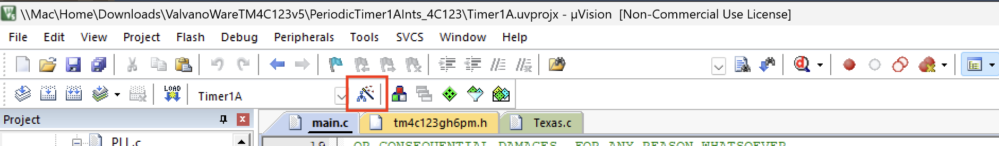
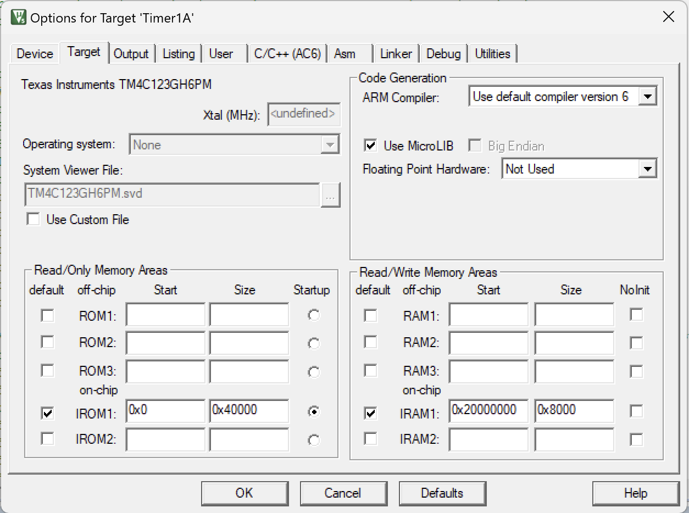
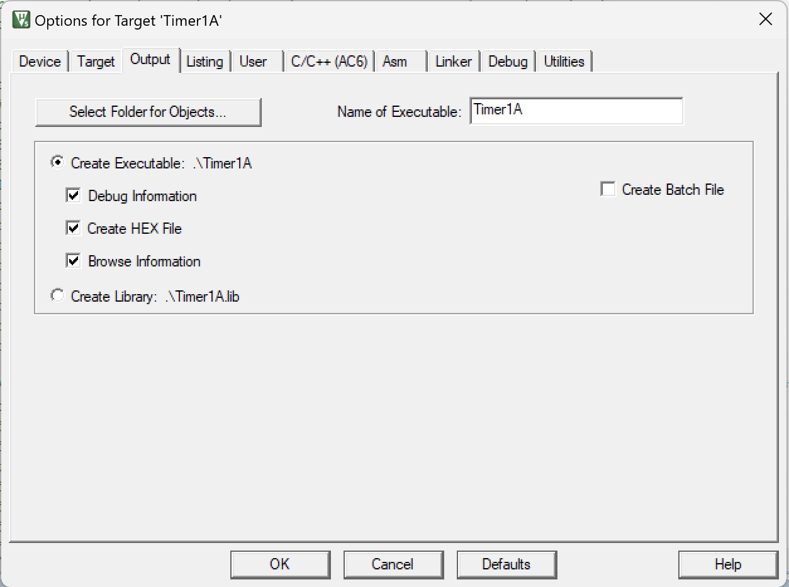
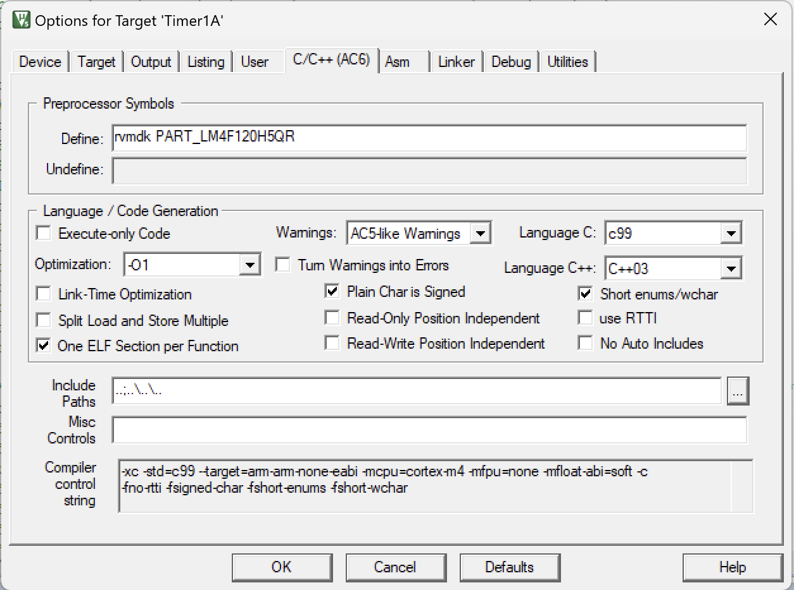
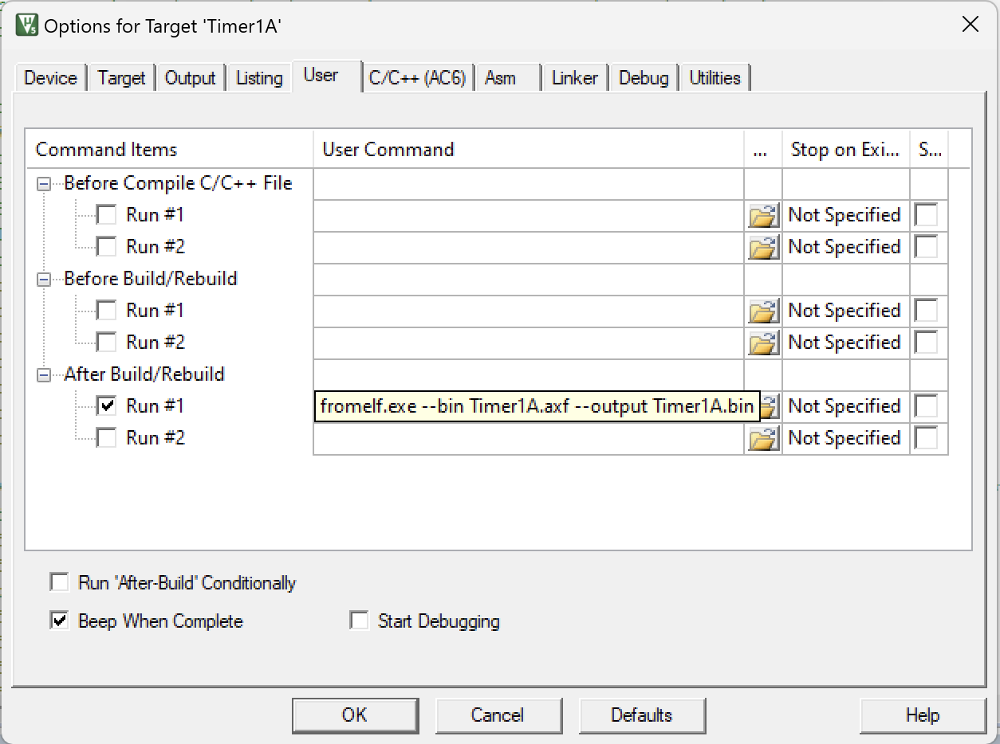
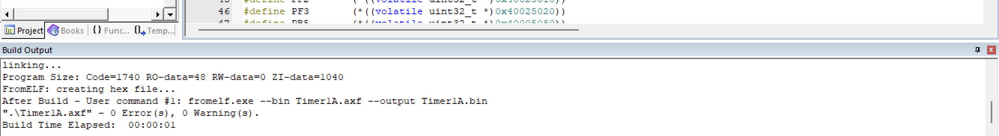
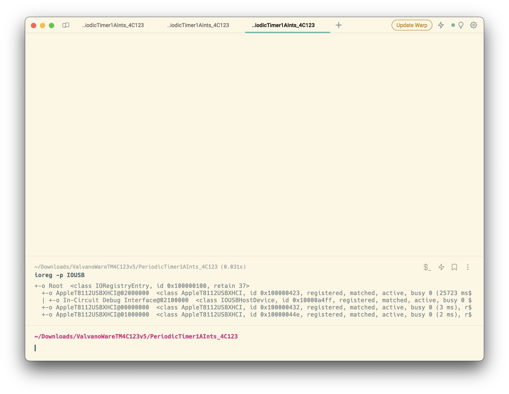
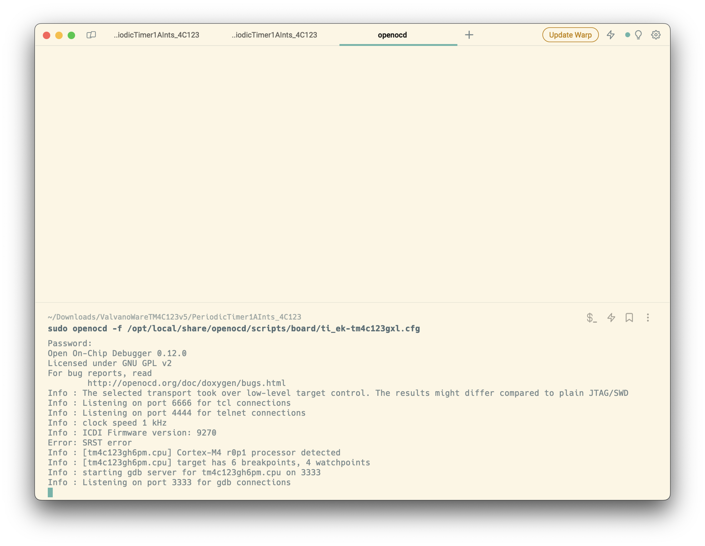
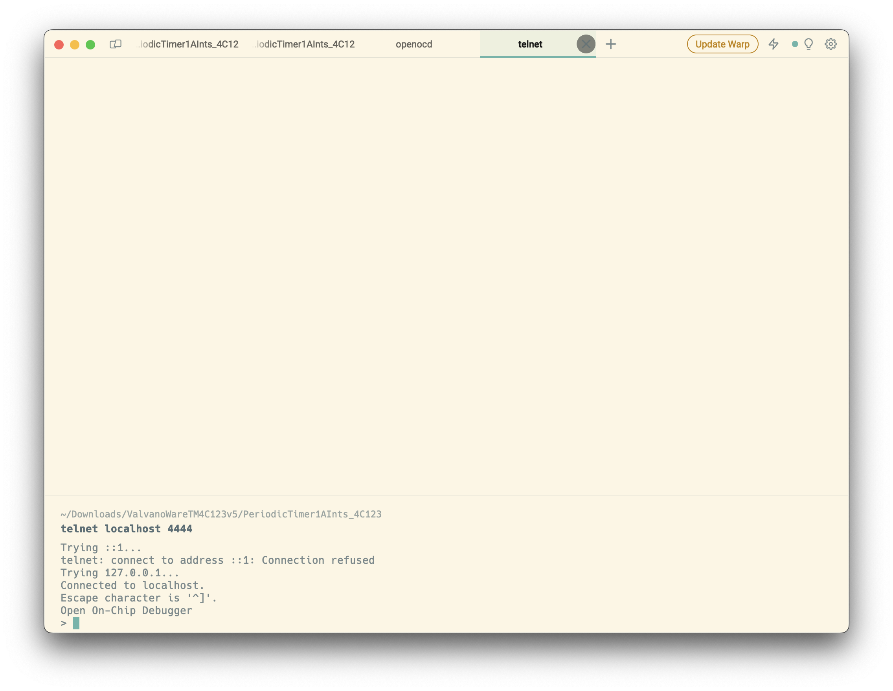
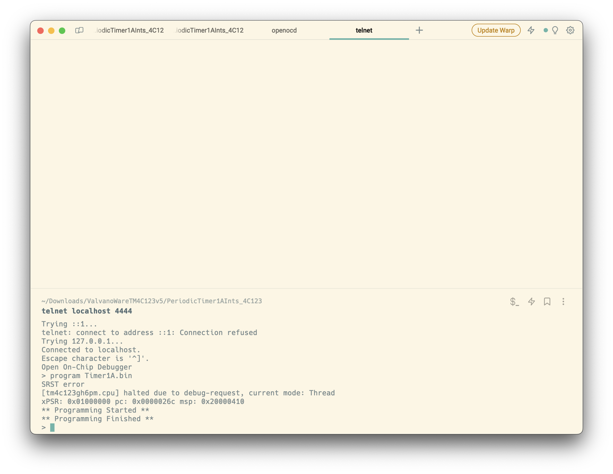

# Setting up Keil development on Apple Silicon Macs
This guide will show you how to run Keil MicroVision5 in a Windows VM as well as being able to flash/debug the TM4C123GXL.

## Setting up Keil MicroVision5

### Prerequisites
This guide was developed using Parallels, but should work with any VM software. Parallels is endorsed by Microsoft and comes configured with Windows 11 on ARM. It is not a free software, a student license is $49/year and a pro student license is $59/year.

You can download Parallels from [here](https://www.parallels.com/products/desktop/download/).

### Installing Keil
To install Keil MicroVision5, you can follow the steps exactly as outlined in Dr. Valvano's guide [here](https://users.ece.utexas.edu/~valvano/EE445L/downloads.htm#Keil). Stop at the "How to install LaunchPad drivers for the TM4C123" section.

After installing Keil, you'll need to install a few more things:

1. The TivaWare library. You can download it from [here](http://www.ti.com/tool/sw-tm4c).
2. ValvanoWare_v5. You can download it from [here](http://users.ece.utexas.edu/~valvano/arm/ValvanoWareTM4C123v5.zip).
3. EE319KWare. You can download it from [here](http://users.ece.utexas.edu/%7Evalvano/Volume1/EE319K_Install.exe).

### Setting up Keil and testing build
Now that you have Keil and the libraries installed, you can open Keil and try to build a project. To test, I used the `PeridiocTimer1AInts_4C123` project from the ValvanoWare_v5 folder. 

1. Open Keil and click on `Project` -> `Open Project...` and navigate to the `PeridiocTimer1AInts_4C123` folder. Click on `PeridiocTimer1AInts_4C123.uvprojx` and click `Open`.
2. Now we need to setup some options for the target. Click on the `Options for Target 'PeridiocTimer1AInts_4C123'` button. 

3. In the `Target` tab, under the code generation section, make sure that the ARM compiler is set to "Use default compiler version 6".

4. In the `Output` tab, make sure that the `Create HEX File` box is checked.

5. In the `C/C++` tab, under the `Languge/Code Generation` section, make sure that Language C is set to "c99".

6. In the `User` tab, add a User Command to the `After Build/Rebuild` section. The command should be `fromelf.exe --bin Timer1A.axf --output Timer1A.bin`. This will convert the .axf file to a .bin file that we can flash to the board. We are using the `Timer1A.axf` file because that is the name of the file that is generated when we build the project, so if you are using a different project, you will need to change the input and output file names.

7. Click `OK` to save the settings.

Now we can build the project. Click on the `Build` button. If everything is setup correctly, you should see something like this in the output window:

Check the `PeridiocTimer1AInts_4C123` folder and you should see a `Timer1A.bin` file. This is the file that we will flash to the board.

## Setting up flashing/debugging using OpenOCD

### Prerequisites
To flash and debug the TM4C123GXL, we will be using OpenOCD. You can install OpenOCD using MacPorts or Homebrew. I used MacPorts, but I will include the Homebrew commands as well.

#### MacPorts
1. Install MacPorts from [here](https://www.macports.org/install.php).
2. Install OpenOCD using `sudo port install openocd`.
3. To see what files were installed, you can use `port contents openocd`.

#### Homebrew
1. Install Homebrew from [here](https://brew.sh/).
2. Install OpenOCD using `brew install openocd`.
3. To see what files were installed, you can use `brew list openocd`.

### Flashing using OpenOCD
You may need to install some more packages for OpenOCD to work. I had to install `libusb` and `pkg-config`, but you may need to install more. You can install them using MacPorts or Homebrew.

Now connect the TM4C123GXL to your Mac using a USB cable. Open a terminal and run `ioreg -p IOUSB`. You should see something like this showing that the board is connected:

Now we can flash the board. Open a new terminal and navigate to the `PeridiocTimer1AInts_4C123` folder. Run `openocd -f /opt/local/share/openocd/scripts/board/ti_ek-tm4c123gxl.cfg`. You should see something like this:

This is a gdb server that can be used for debugging.

Open another terminal and navigate to the `PeridiocTimer1AInts_4C123` folder. Run `telnet localhost 4444`. You should see something like this:

This is a telnet server that we can use to pass OpenOCD commands for flashing.

Run `program Timer1A.bin`. You should see something like this:

Now hit the reset button on the board and you should see the LED cycle through the colors. You've successfully flashed the board!

### Debugging using OpenOCD

#### Prerequisites
WIP (Will be updated soon)